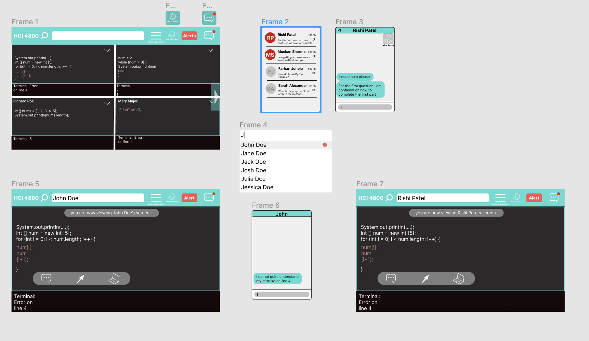
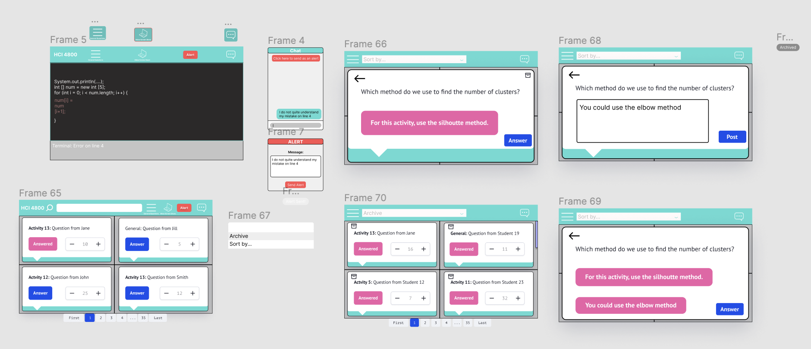

# Milestone 4

## A. High Fiedelity Prototype

### Teacher View Prototpye

The User Stories below is what we implemented in our Teacher View prototype.
#### User Story 1
- **As a teacher I want to be able to communicate to my students though a simple chat box so that I can quickly communicate any concerning issues.**
  - For this user story, we included a chat icon at the top bar that is easily identifiable to the user. This chat icon will also show a red dot indicating new messages or new alerts. Upon click the chat icon, a drop down chat menu will pop up showing the most recent chat messages. A user with an active alert will have a red icon on their name. These design elements make it easier for the teacher to see any issues a student might have during a class since it will notify them directly on their screen. Also, the chat functionality allows the teacher to quickly communicate answers to the student all in one location.

#### Demo Video
<iframe width="560" height="315" src="https://www.youtube.com/embed/T7bWwazXEOA" title="YouTube video player" frameborder="0" allow="accelerometer; autoplay; clipboard-write; encrypted-media; gyroscope; picture-in-picture" allowfullscreen></iframe>

#### User Story 2
- **As a teacher, I want to be able to see my students’ screens so that I can quickly focus my attention on a student that needs help.**
  - In the application, the teacher will always be able to see all the students screen on the main screen of the application. When searching for a student, a red dot will be next to their name indicating that the student has an active alert and needs help. Upon clicking on the students name, the teacher can view their screen, chat with the student, or control their screen. This functionality allows the teacher to directly address any problem the student is having. The screen share functionality makes it easier for the teacher to see the students' thought process and the teacher can then chat with the student to suggest changes or solutions.

#### Demo Video
<iframe width="560" height="315" src="https://www.youtube.com/embed/GgxTgYFkXKw" title="YouTube video player" frameborder="0" allow="accelerometer; autoplay; clipboard-write; encrypted-media; gyroscope; picture-in-picture" allowfullscreen></iframe>

#### Figma Prototype Teacher View
<iframe style="border: 1px solid rgba(0, 0, 0, 0.1);" width="800" height="450" src="https://www.figma.com/embed?embed_host=share&url=https%3A%2F%2Fwww.figma.com%2Fproto%2Fb23fewnEyw6ymh97GU7s4A%2FTeacher-View-Prototype%3Fnode-id%3D2%253A2%26scaling%3Dmin-zoom%26page-id%3D0%253A1%26starting-point-node-id%3D2%253A2" allowfullscreen></iframe>

##### Screen Shots

[Link to figma file](https://www.figma.com/file/b23fewnEyw6ymh97GU7s4A/Teacher-View-Prototype) 

#### Student View Prototpye

The User Stories below is what we implemented in our Student View prototype.

#### User Story 3
- **As a student, I want to be able to alert my professor that I have a question so that I can receive help.**
  - In this user story, the student will always have the top menu bar active no matter what other application they are on. If a student runs into any problems while doing their assignment, they can create an alert by clicking on the alert icon on the top. Once they click on the icon, they can put in a message along with their alert to notify the teacher that they have a problem. The student can also send an alert while in the chat menu. Instead of raising your hand or walking up to the professor at the front of the classroom, the student can simply create an alert and wait where they are until the professor addresses their issue. 

#### Demo Video
<iframe width="560" height="315" src="https://www.youtube.com/embed/4I2C-oEIqXs" title="YouTube video player" frameborder="0" allow="accelerometer; autoplay; clipboard-write; encrypted-media; gyroscope; picture-in-picture" allowfullscreen></iframe>

#### User Story 4
- **As a student I want to see questions and answers to common questions at the top so that the same question is not being answered multiple times**
  - This user story addresses the issue of repeated questions and allows other students to chime in to reduce load on the professor. The student can access the general questions page by clicking on the icon at the top of their screen. They will then be brought to the discussion board page where they can see questions other students had and answers from either the professor or other students. While working on an activity it is not uncommon for students to run into the same issue and instead of asking the same question to the professor, the student can view this discussion board first to see if their problem is addressed in there. This board will expedite the rate at which students will get answers to their problems and will reduce the amount of questions the professor has to individually respond to.
  
#### Demo Video
<iframe width="560" height="315" src="https://www.youtube.com/embed/eP3xMGDEoXY" title="YouTube video player" frameborder="0" allow="accelerometer; autoplay; clipboard-write; encrypted-media; gyroscope; picture-in-picture" allowfullscreen></iframe>

#### Figma Prototype Student View
<iframe style="border: 1px solid rgba(0, 0, 0, 0.1);" width="800" height="450" src="https://www.figma.com/embed?embed_host=share&url=https%3A%2F%2Fwww.figma.com%2Fproto%2F2jdxFWFSppvaT0ufsrkUoz%2FStudent-View-Protoype%3Fnode-id%3D7%253A51%26scaling%3Dmin-zoom%26page-id%3D0%253A1%26starting-point-node-id%3D7%253A51" allowfullscreen></iframe>

##### Screen Shots

[Link to figma file](https://www.figma.com/file/2jdxFWFSppvaT0ufsrkUoz/Student-View-Protoype?node-id=0%3A1) 

## B. Testing Protocol

### Research Question
**Does having a screen sharing application in an educational setting improve communication and effectiveness of the lectures?**

### Testing Methodology
- We will be using a mixed methodology for testing. Our team will use a factorial design of experimentation, and then focus groups to then gather the user’s opinions. We want to use a factorial design of testing to make sure that we are gathering data from all different majors and class levels. We want to be able to observe different independent variables in a setting where the application is being used, so we do not have to repeat the experiment a multitude of times. We will observe the effects of the experiment on different participants by gathering quantitative and qualitative data. We will also compare this data with our control group to look for any outliers or abnormalities. We plan on carrying out the experiment a few times to also ensure the accuracy of the results. We also want to employ the use of focus groups to gather intel on the user’s experience with the application. These focus groups will randomly sample from the pool of participants that we have. With their consent, we will question them on a few different things. For instance, we will ask for any concerns they had with the applications as well as any feature they enjoyed. We will also ask if they enjoyed the overall experience and whether they would like to see this application being implemented more throughout their university. This will allow for a deeper look into the effectiveness of the application that goes beyond the normal quantitative data. This can also give us the opportunity to better our produce and can into account any recommendations. With the data from both procedures combined, we can determine if the use of the software leads to a more effective classroom or not. 

### Testing Procedure

- **Informed Consent**
  - To ensure that the experiment is being carried out ethically, each experiment will be fully voluntary, and the participants will have the option to opt out at any point during the procedure if they wish to do so. Each participant will also be informed of all the data being gathered -- qualitative and quantitative. We will explain the nature of the experiment as well as the expectations and goals. We will cover every step of the experiment and its significance. We also plan on gathering written consent to publish any findings if necessary. Participants will be given time to ask any questions and clear up any misconceptions before the experiment starts. 
  - For the focus groups, we will randomly sample from the pool of participants. If picked, the participant will have the choice to not do the focus study. Participants can also volunteer to voice their opinions of the study if they wish to do so.

- **Data Collection**
  - We will be collecting quantitative and qualitative data. For the quantitative data, we plan on monitoring how long it takes for the professor to answer students' questions in both the experimental and control groups. We also want to see how fast the students are able to answer each other’s questions. Furthermore, we plan to keep track of how many questions are asked in a classroom with the application and how many questions are asked in a classroom without it. We want to be able to differentiate each data point by different class levels as well as majors. We want to answer which class level tends to increase in questions asked and time in which each question is answered the most? Which major? Why? What are some techniques we can recommend to the users to help them maximize their use of the product based on how their peers react? We want to put numbers to some questions and statements to help us evaluate the success of the product. For the professors, we are looking to see how many students the professors are able to reach in both the control groups and the experimental groups. 
  - From our focus groups, we plan on gathering qualitative data. We want to ask questions that will expose the effect of the study on the students. We want to know their thoughts, concerns and opinions on the product. We plan on asking unbiased and non leading questions such as:

    > - Was it easy or difficult to get your questions answered in a timely manner? 
    > - To what extent did you feel like you were helped with your question answered by students and professors alike? 
    > - Please rate your overall experience with the application on a scale of 1-5. 
  
  - We also wish to have a focus group for professors where we ask similar questions, but geared more towards them. 

- **Analysis**
  - We will analyze our quantitative data by comparing it to our control group. We will measure how long it takes for the professors and other students to answer and ask questions in a traditional classroom, as discussed above, and compare it to the data from the classroom where the application is being used. We are hoping to see a faster reaction time from both professors and students. For our qualitative data, we are looking for both negative and positive comments. Our plan is to categorize any comments and concerns based on the subject. 

- **Testing procedures during a pandemic**
  - To ensure the safety of all of our participants, we will follow the CDC guidelines for COVID-19 in schools and other educational settings. We will recommend the use of masks, and seat students at a safe distance from one another. The researchers, themselves, will be wearing masks. 

## C. Summary Video
<iframe width="560" height="315" src="https://www.youtube.com/embed/mdHeUfOXa8c" title="YouTube video player" frameborder="0" allow="accelerometer; autoplay; clipboard-write; encrypted-media; gyroscope; picture-in-picture" allowfullscreen></iframe>
[Video Link](https://youtu.be/mdHeUfOXa8c)

## [Home](index.md)

